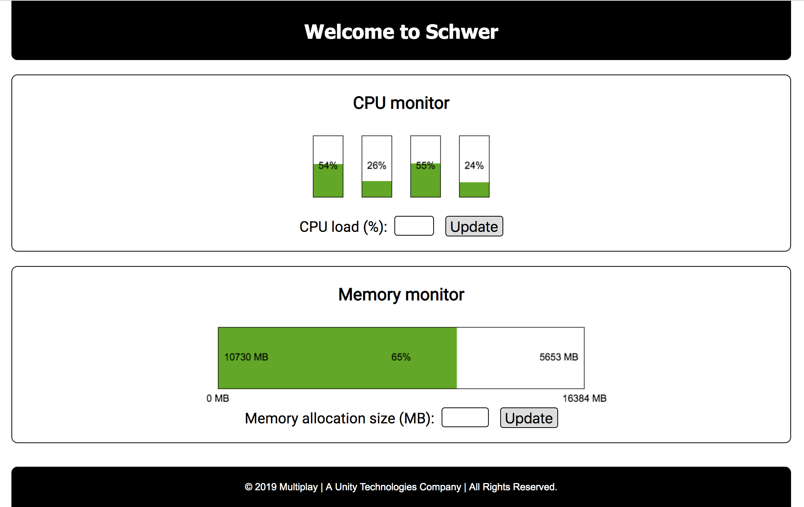

# Schwer

_German_ | _adjective_ | /ʃveːɐ/ | _meaning_: heavy

A single binary application with built-in web front-end that can produce cpu/mem load.

## Installation

1. Clone this repo
2. Change working directory to your local cloned repo
3. `$ go generate . && go build .`

## Usage

Once you built the application, just run it. Schwer, by default, binds to port `9999`, but you
can specify a different port (between 1024-65535) if you like by using the `-port` flag:

`$ ./schwer -port 19999`

### Web

While Schwer is running, you can open the web front-end in your browser by visiting `localhost:<port>`.

You should see something like this:

The amount of CPU load percentage Schwer can produce can be specified by typing a number between
0 - 100 into the little input field and hitting enter or clicking the `[Update]` button.

The size of extra memory to be allocated (on top of the memory consumption of Schwer itself) can be
set by typing a positive integer (in MB) into the little input field and hitting enter or clicking
the `[Update]` button.

### API

You can also use Schwer via its HTTP API.

| Endpoint | Method | Params | Response code |  Description |
| -------- | ------ | ------ | ------------- |  ----------- |
| `/cpu`   | `GET`  | `-`    | 200 OK        | Returns an array of CPU utilisation levels per core (e.g. `[49, 34, 50, 32]` in case of a machine with 4 cores). |
| `/cpu`   | `POST` | `pct` - load level % (0-100) | 202 Accepted 400 Bad Request | Sets the load level for Schwer to produce. |
| `/mem`   | `GET`  | `-`    | 200 OK        | Returns a JSON object of memory stats in MB (e.g. `{"total": 16384, "available": 5413, "used": 10966, "usedpct": 67}`). |
| `/mem`   | `POST` | `size` - memory allocation size in MB | 202 Accepted 400 Bad Request | Schwer allocates this amount of extra memory. |

## Limitations

Under the hood Schwer spins up a goroutine for each CPU core in order to make them busy. However,
due to the nature of the Go runtime and scheduler, a goroutine cannot tell which CPU core it is
running on. Hence, Schwer cannot control the load of a specific CPU core (i.e. one cannot set 70%
load for CPU core #1 and 15% load for CPU core #2, etc.). For this reason Schwer tries to load all
CPU cores equally.

## TODO

- [ ] Flesh out CPU load
- [x] CPU load monitor
- [ ] Flesh out memory load
- [x] Memory load monitor
- [ ] Make it work on Windows
